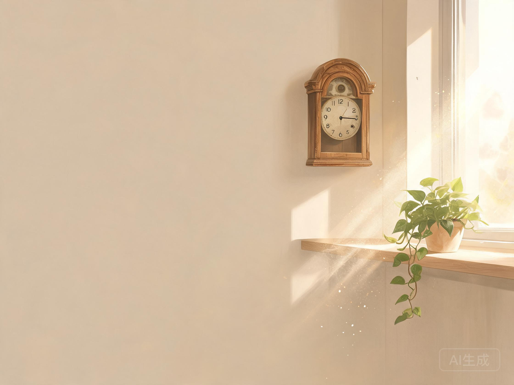
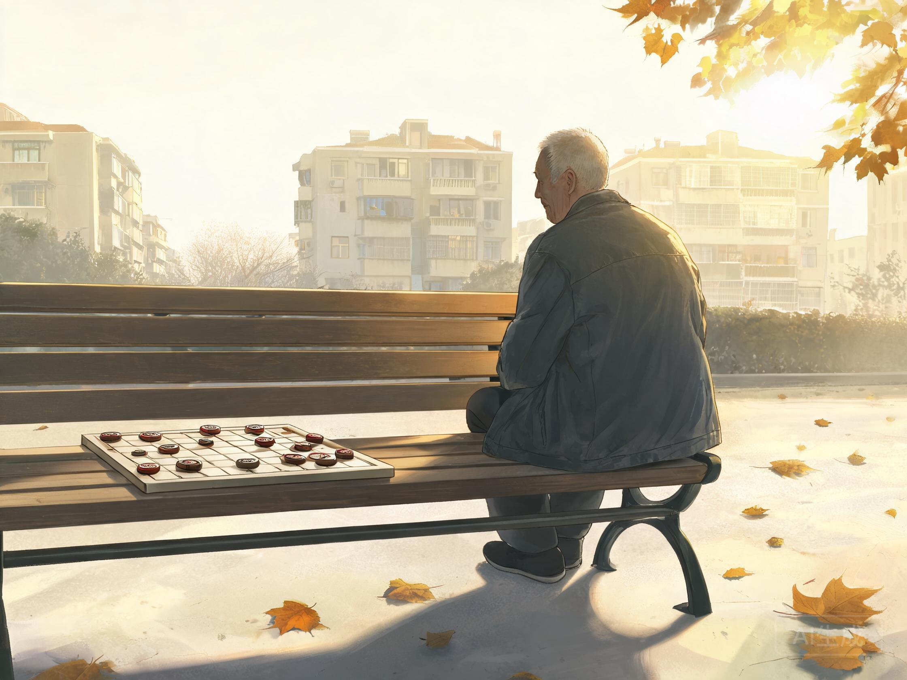

# 张叔退休那天，我在阳台上看了他很久

::: magazine-cover
献给一位终于慢下来的老人

**张叔退休那天**

六点一刻，再也没有人等他出门

:::

::: text-card
开篇

张叔退休，是开春那阵子的事。
我是在阳台上看见的。头一天，他还是一大清早锁门下楼，一身洗得发白的深蓝工装，腰板挺得笔直——跟过去三十年一模一样。第二天，我就不太习惯了。
:::

六点一刻，楼道里没有那道锁门的声响了。我正纳闷，张叔怎么还没出门，就听我妈在屋里头说了句：

> 「今天星期几？张叔，是不是不去厂里了。」

噢。他退休了。

此后几天，变化是安静的。他不早起了，也几乎不下楼。每天上午，他搬一把旧木椅坐到阳台，一坐就是一上午。我妈看了叹气，说他跟个弦松了的钟似的。

::: quote-card
「人呐，不能闲下来，一闲就慌。」

**—— 我妈的老话**
:::

我妈这句老话，张叔信了一辈子。*这会儿忽然让他闲下来，他就只能坐在窗前，把外头看一遍，再看一遍。*

我见过他把那只用了十几年的饭盒，一天洗一遍，再晾到窗台上。也见过他对着客厅那口挂钟，看得很久。那种眼神我认得——他不是在看钟，是在想，这个点，原本该在干什么。

你有没有见过一个人，把一份工作干了大半辈子，干到那身工装都像是长在他身上。退休，是把这身「长在身上」的东西，轻轻揭下来。人一下子，*变得很轻，又很空。*

有天傍晚，我在楼道里碰到他。他拎着一袋菜，站在自家门口，钥匙在手里捏了很久，才开门。我喊他张叔，他冲我扯了扯嘴角，说：

> 「也没什么事，就是突然，不知道这个点该干嘛了。」

就是那一下，我有点难受。

他这三十年，天没亮就起来，把一天的时间一段一段，分给了厂里、分给了家、分给了接送孙子。退休那天起，这些分法，一并收了回去。没人告诉他，剩下这一整天，该怎么过。

::: pullquote
其实没有人，再在早上六点一刻，等他出门了。
:::

真正松下来，是一个礼拜之后的事。楼下的老李头不知从哪天起，每天午后在院子里摆一副象棋。这天，他隔着窗户喊：「老张！下来坐坐，不下棋，坐坐也行。」

张叔那扇门，犹豫了一下午。可到了四点多，他还是下楼了。也没下棋，就坐在长椅那头，晒着太阳，看老李头跟人杀棋，看了一整个下午。

我从那天起，才对「退休」这两个字，有了一点模模糊糊的理解。其实也说不太清。大概就是——那些他分了大半辈子的日子，现在，得他自己一段一段，收回来。

我不会劝他「想开点」。我也不确定，他现在是不是真的习惯了。我只知道，后来每到下午，楼下那张长椅上，都有他了。阳光好的时候，他坐在那头，棋盘搁在中间，偶尔，也跟老李头走两步。

::: pullquote
他正在，把剩下的每一天，一点一点，重新装回自己手里。
:::

---

::: end-card
晚晴

献给所有终于慢下来、重新把日子装回手里的人
:::